# 🥎 ScoreApp — Marcador de Pádel

Aplicación móvil (Android / iOS / Web) para llevar el marcador de partidos de pádel en tiempo real, con estadísticas detalladas, historial de partidos y soporte multi-idioma. Construida con **Expo**, **React Native** y **TypeScript**, con toda la lógica de puntuación de pádel implementada como un motor de dominio puro y testeado.

<p align="center">
  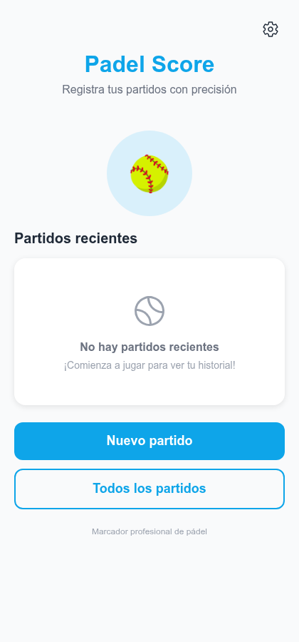
  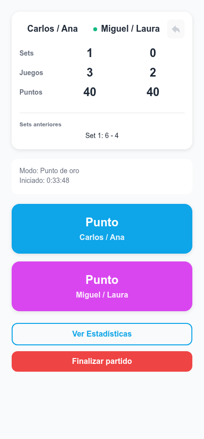
  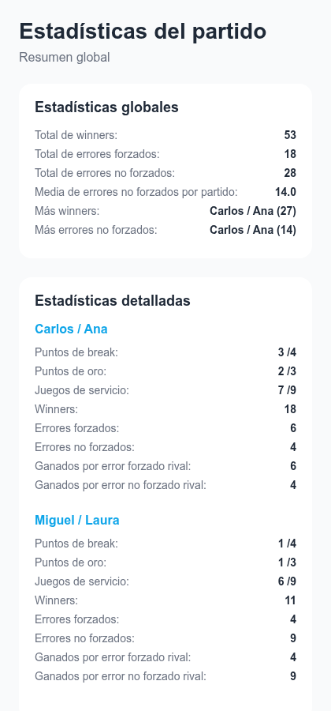
  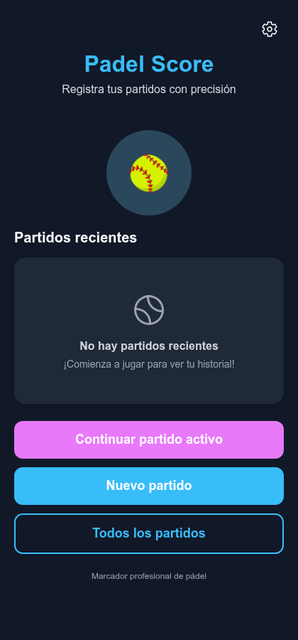
</p>

---

## Índice

- [Stack tecnológico](#stack-tecnológico)
- [Arquitectura](#arquitectura)
- [Estructura de carpetas](#estructura-de-carpetas)
- [Funcionalidades](#funcionalidades)
- [Capturas de pantalla](#capturas-de-pantalla)
- [Reglas de puntuación soportadas](#reglas-de-puntuación-soportadas)
- [Puesta en marcha](#puesta-en-marcha)
- [Scripts disponibles](#scripts-disponibles)
- [Testing](#testing)
- [Despliegue](#despliegue)

---

## Stack tecnológico

| Categoría | Tecnología | Uso en el proyecto |
|---|---|---|
| Framework | [Expo SDK 54](https://expo.dev/) | Toolchain, bundler (Metro) y runtime multiplataforma (Android/iOS/Web) |
| UI | [React Native 0.81](https://reactnative.dev/) + [React 19](https://react.dev/) | Componentes nativos |
| Navegación | [Expo Router 6](https://docs.expo.dev/router/introduction/) | Enrutado basado en ficheros (`src/app`), navegación tipo stack |
| Estilos | [NativeWind 4](https://www.nativewind.dev/) + [Tailwind CSS](https://tailwindcss.com/) | Utilidades Tailwind sobre componentes RN; también se usa `StyleSheet` nativo en pantallas más complejas |
| Estado global | [Zustand 5](https://zustand.docs.pmnd.rs/) | Store único (`src/store`) para el partido activo, historial y acciones |
| Persistencia | [`@react-native-async-storage/async-storage`](https://react-native-async-storage.github.io/async-storage/) | Guarda el partido activo, el historial de partidos, el idioma y el tema en el dispositivo (o `localStorage` en Web) |
| Internacionalización | [i18next](https://www.i18next.com/) + [react-i18next](https://react.i18next.com/) | Español (por defecto) e inglés, con detector de idioma persistente |
| Gráficas | [react-native-svg](https://github.com/software-mansion/react-native-svg) | Gráfico de tarta (`PieChart`) dibujado a mano para las estadísticas |
| Iconografía | `@expo/vector-icons` (Ionicons) | Iconos de la interfaz |
| Lenguaje | [TypeScript 5.9](https://www.typescriptlang.org/) | Tipado estricto en dominio, store, componentes y pantallas |
| Testing | [Vitest 1](https://vitest.dev/) | Tests unitarios del motor de puntuación (dominio puro, sin dependencias de RN) |
| Animaciones (dependencia) | `react-native-reanimated` / `react-native-worklets` | Requeridas por el ecosistema Expo/Router |
| Despliegue Web | [EAS CLI](https://docs.expo.dev/eas/) (`eas-cli`) | Export estático + `eas deploy` |

Alias de imports: `@/*` apunta a `src/*` (configurado en `tsconfig.json` y `babel.config.js` vía `expo-router`).

---

## Arquitectura

La aplicación sigue una separación clara entre **dominio** (lógica de negocio pura), **estado** (orquestación y persistencia) y **presentación** (pantallas y componentes), lo que permite testear las reglas de pádel sin necesidad de renderizar nada.

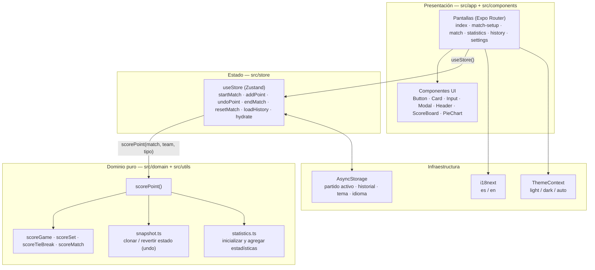

**Capas y responsabilidades:**

1. **Dominio (`src/domain`, `src/utils/scoring.ts`, `src/utils/statistics.ts`)** — Funciones puras e inmutables que implementan las reglas de pádel: puntuación de juego (`scoreGame.ts`), set (`scoreSet.ts`), tie-break (`scoreTieBreak.ts`) y partido (`scoreMatch.ts`), orquestadas por `scorePoint.ts`. No dependen de React ni de React Native, por lo que se testean directamente con Vitest.
2. **Estado (`src/store/index.ts`)** — Un único store de Zustand expone el `currentMatch`, el `history` y las acciones (`startMatch`, `addPoint`, `undoPoint`, `endMatch`, `resetMatch`, `hydrate`, `loadHistory`, `clearHistory`). Cada acción de mutación persiste el resultado en `AsyncStorage` antes de actualizar el estado en memoria.
3. **Snapshots e historial de jugadas (`src/domain/match/snapshot.ts`)** — Cada punto (`PointEvent`) guarda una foto (`stateBefore` / `stateAfter`) del marcador y las estadísticas. Esto es lo que permite un **deshacer (undo) ilimitado y exacto**, incluso tras completar un set, un tie-break o el propio partido.
4. **Persistencia (`src/utils/storage.ts`)** — Capa sobre `AsyncStorage` con "revivers" que reconstruyen correctamente los `Date` al leer JSON desde disco, tanto para el partido activo como para el historial completo.
5. **Presentación (`src/app`, `src/components`, `src/layout`)** — Pantallas enrutadas por archivo con Expo Router, componentes UI reutilizables (`Button`, `Card`, `Input`, `Modal`, `Header`) y un layout común (`ComponentLayout`) que aplica el `SafeAreaView` y el color de fondo del tema activo.
6. **Transversales** — `ThemeContext` (tema claro/oscuro/automático, persistido) e `i18next` (idioma es/en, persistido) envuelven toda la app desde `src/app/_layout.tsx`.

---

## Estructura de carpetas

```
scoreApp/
├─ src/
│  ├─ app/                     # Rutas (Expo Router)
│  │  ├─ _layout.tsx           # Providers globales (Theme, i18n, SafeArea) + hidratación del store
│  │  ├─ index.tsx             # Home: accesos rápidos y partidos recientes
│  │  ├─ match-setup.tsx       # Alta de equipos y configuración del partido
│  │  ├─ match.tsx             # Marcador en vivo (pantalla principal de juego)
│  │  ├─ statistics.tsx        # Estadísticas del partido actual y globales
│  │  ├─ history.tsx           # Historial de partidos finalizados
│  │  └─ settings.tsx          # Tema e idioma
│  ├─ components/
│  │  ├─ ui/                   # Button, Card, Header, Input, Modal
│  │  ├─ match/ScoreBoard.tsx  # Marcador (sets/juegos/puntos + saque + undo)
│  │  └─ charts/pieChart.tsx   # Gráfico de tarta dibujado con SVG
│  ├─ domain/
│  │  ├─ scoring/              # scorePoint, scoreGame, scoreSet, scoreTieBreak, scoreMatch
│  │  └─ match/snapshot.ts     # Clonado y restauración de estado (undo)
│  ├─ store/index.ts           # Store global (Zustand)
│  ├─ utils/                   # scoring.ts, statistics.ts, storage.ts
│  ├─ contexts/ThemeContext.tsx
│  ├─ constants/theme.ts       # Paletas de color light/dark
│  ├─ i18n/                    # Configuración i18next + locales es/en
│  ├─ layout/ComponentLayout.tsx
│  └─ types/index.ts           # Tipado de dominio compartido
├─ src/__tests__/scoring.test.ts
├─ vitest.config.ts
├─ tailwind.config.js / nativewind-env.d.ts / babel.config.js / metro.config.js
└─ app.json                    # Configuración Expo
```

---

## Funcionalidades

### 🏠 Inicio
- Accesos directos a **nuevo partido**, **historial completo** y **configuración**.
- Lista de los **5 partidos más recientes** con resultado (sets) y fecha.
- Botón para **continuar un partido en curso** si lo hay al abrir la app.

### 📝 Configuración de partido (`match-setup`)
- Alta de **2 jugadores por equipo** (nombre libre) con validación de campos obligatorios.
- Selección de **quién saca primero**.
- Selección del **modo de puntuación**: *Punto de oro* (golden point) o *Ventaja* (deuce/advantage clásico).
- Si ya hay un partido en curso, pide confirmación antes de reemplazarlo por uno nuevo.

### 🎾 Marcador en vivo (`match`)
- Marcador completo en tiempo real: **puntos, juegos, sets y tie-break**, con indicador visual de **quién saca**.
- Registro de punto por equipo con **clasificación del punto**:
  - 🟦 *Winner* (ganado directamente)
  - 🟪 *Error forzado del rival*
  - 🟥 *Error no forzado del rival*
- **Deshacer (undo) ilimitado**: revierte punto a punto —incluso a través de juegos, sets, tie-breaks o un partido ya finalizado— restaurando marcador y estadísticas exactamente a como estaban.
- Cálculo automático de:
  - Cambios de saque tras cada juego.
  - Inicio de **tie-break a 6 games iguales** (a 7 puntos con 2 de diferencia).
  - **Punto de oro** a 40-40 (si el modo elegido es *golden point*) o **ventaja** (si el modo es *advantage*).
  - Fin de set (6 juegos con 2 de diferencia, o 7-5, o vía tie-break) y fin de partido (al mejor de 3 sets).
- Aviso de confirmación al intentar salir de la pantalla con un partido en curso (botón atrás / gesto del sistema).
- Finalización manual del partido (por ejemplo, por retirada) con confirmación.
- Acceso directo a las **estadísticas del partido** desde la pantalla de juego.

### 📊 Estadísticas (`statistics`)
- **Gráficos de tarta** (SVG) del partido en curso: puntos de break ganados, puntos de oro ganados y juegos de servicio ganados, por equipo.
- **Resumen global** agregando todos los partidos jugados: total de *winners*, errores forzados/no forzados, media de errores no forzados por partido, y quién acumula más *winners* / más errores no forzados.
- **Estadísticas detalladas por equipo**: puntos de break, puntos de oro, juegos de servicio, *winners*, errores forzados/no forzados y puntos ganados por cada tipo de jugada.

### 📜 Historial (`history`)
- Listado de todos los partidos finalizados, con resultado por sets, fecha/hora, modo de puntuación y equipo ganador.
- **Modal de detalle** por partido: resultado set a set, estadísticas comparadas (puntos de break, juegos de servicio, puntos de oro, *winners*, errores) e información del partido (inicio/fin).
- Opción de **borrar todo el historial** con confirmación.

### ⚙️ Configuración (`settings`)
- **Tema**: claro, oscuro o automático (según el sistema operativo), persistido entre sesiones.
- **Idioma**: español o inglés, persistido entre sesiones, con detección automática al primer uso.
- Información de la app (versión, descripción).

### 🌍 Transversal
- **Persistencia local completa**: el partido en curso, el historial, el tema y el idioma sobreviven a cerrar la app (o recargar en Web) gracias a `AsyncStorage`.
- **Multiplataforma**: mismo código para Android, iOS y Web (export estático) gracias a Expo Router + React Native Web.
- **Tipado estricto de extremo a extremo** (TypeScript) desde el dominio de puntuación hasta las props de cada componente.

---

## Capturas de pantalla

| Inicio (claro) | Inicio con historial | Modo oscuro |
|---|---|---|
|  | 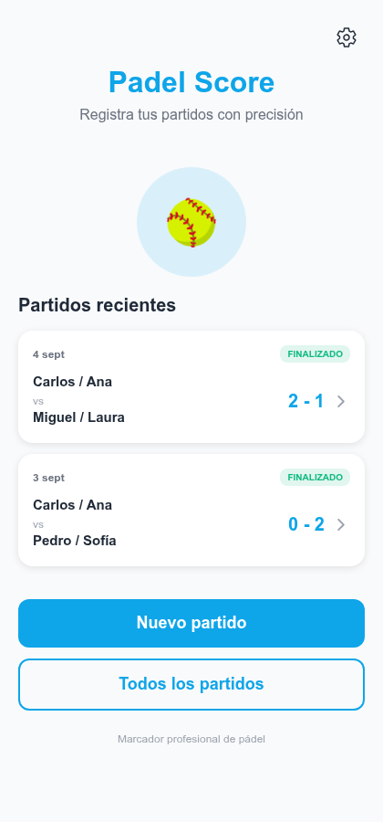 |  |

| Configurar partido | Marcador en vivo (punto de oro) | Tipo de punto |
|---|---|---|
| 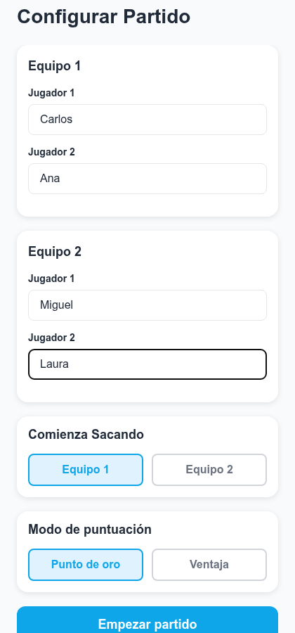 |  | 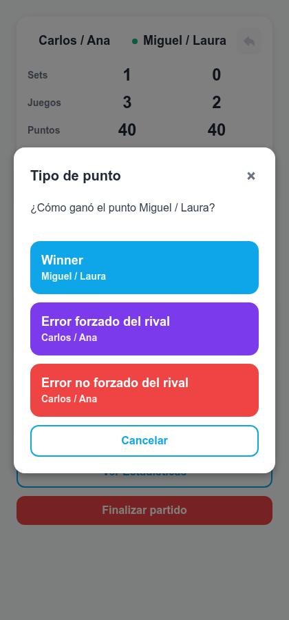 |

| Estadísticas globales | Historial de partidos | Detalle de partido |
|---|---|---|
|  | 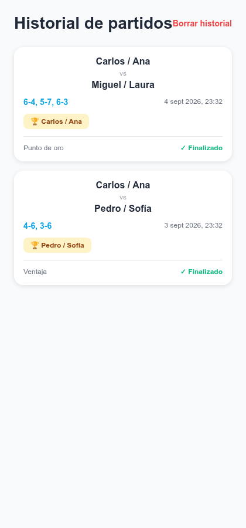 | 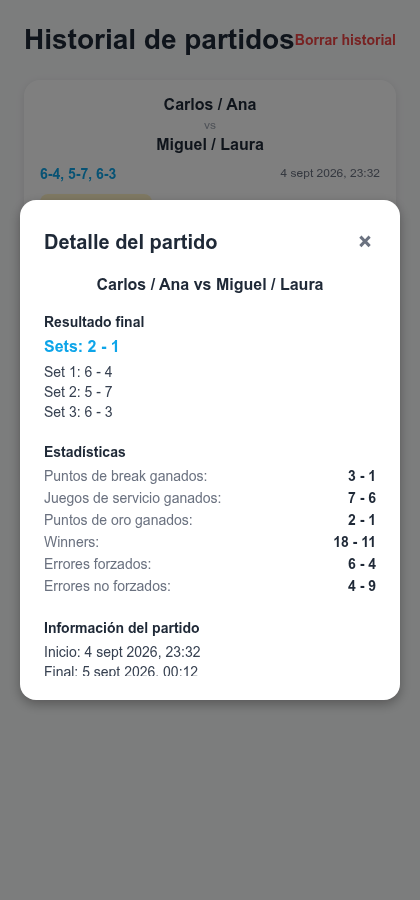 |

| Configuración (claro) | Configuración (oscuro) |
|---|---|
| 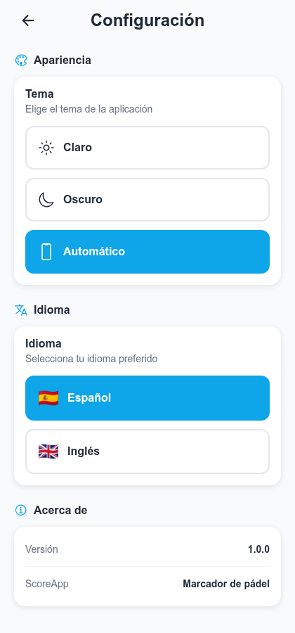 | 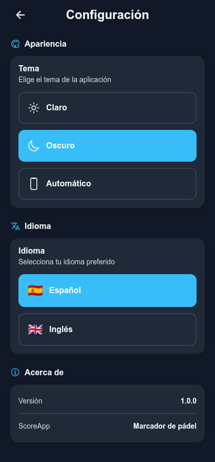 |

> Capturas generadas ejecutando la app en modo Web (`expo start --web`) con datos de ejemplo.

---

## Reglas de puntuación soportadas

El motor de dominio (`src/domain/scoring`) implementa las reglas estándar de pádel/tenis:

- **Puntos por juego**: 0 → 15 → 30 → 40 → juego ganado.
- **Modo Ventaja (`advantage`)**: a 40-40 se juega deuce clásico (ventaja / vuelta a deuce) hasta que alguien gane con 2 puntos de diferencia.
- **Modo Punto de oro (`golden-point`)**: a 40-40 el siguiente punto decide el juego directamente (sin ventajas).
- **Set**: se gana con 6 juegos y 2 de diferencia, o 7-5. A 6 juegos iguales se activa el **tie-break**.
- **Tie-break**: se juega a 7 puntos con 2 de diferencia (sin límite superior).
- **Partido**: al mejor de 3 sets.
- **Estadísticas derivadas automáticamente**: puntos de break, juegos de servicio ganados/perdidos, puntos de oro ganados/perdidos, y desglose de puntos por *winner* / error forzado / error no forzado.
- **Undo consistente**: cada punto guarda una instantánea (`snapshot`) del estado anterior, permitiendo deshacer cualquier jugada —incluidas las que cierran un juego, un set o el partido— sin recalcular nada.

Todo este comportamiento está cubierto por **18 tests unitarios** en [`src/__tests__/scoring.test.ts`](src/__tests__/scoring.test.ts).

---

## Puesta en marcha

### Requisitos

- [Node.js](https://nodejs.org/) ≥ 18 (probado con Node 20)
- npm (incluido con Node)
- La app [Expo Go](https://expo.dev/go) en tu móvil (opcional, para probar sin emulador) o un emulador Android/iOS configurado

### Instalación

```bash
git clone <url-del-repositorio>
cd scoreApp
npm install
```

### Ejecutar en desarrollo

```bash
npm start          # Abre el Metro Bundler / Expo Dev Tools
npm run android    # Ejecuta en un emulador o dispositivo Android
npm run ios        # Ejecuta en un simulador o dispositivo iOS (macOS)
npm run web        # Ejecuta en el navegador
```

---

## Scripts disponibles

| Script | Descripción |
|---|---|
| `npm start` | Inicia el servidor de desarrollo de Expo |
| `npm run android` | Compila y ejecuta la app en Android |
| `npm run ios` | Compila y ejecuta la app en iOS |
| `npm run web` | Ejecuta la app en el navegador (React Native Web) |
| `npm test` | Ejecuta la suite de tests con Vitest |
| `npm run deploy` | Exporta la versión Web (`expo export -p web`) y la despliega con EAS |

---

## Testing

La lógica de puntuación está aislada del framework de UI, lo que permite testearla como funciones puras:

```bash
npm test
```

Cobertura actual: progresión de puntos, deuce/ventaja, punto de oro, juegos de servicio y *breaks*, tipos de punto (winner / error forzado / error no forzado), sets a 6-4 y 7-5, activación y resolución de tie-break (incluyendo tie-breaks largos), finalización de partido a 2 sets, y **deshacer (undo)** en cada uno de los escenarios anteriores.

---

## Despliegue

El proyecto usa **Expo Application Services (EAS)** para desplegar:

- **Web**: `npm run deploy` exporta el sitio estático (`expo export -p web`) y lo publica con `eas-cli deploy`. Más info: [EAS Hosting](https://docs.expo.dev/eas/hosting/get-started/).
- **Android / iOS**: `npx eas-cli build` genera los binarios nativos. Más info: [EAS Build](https://expo.dev/eas).
